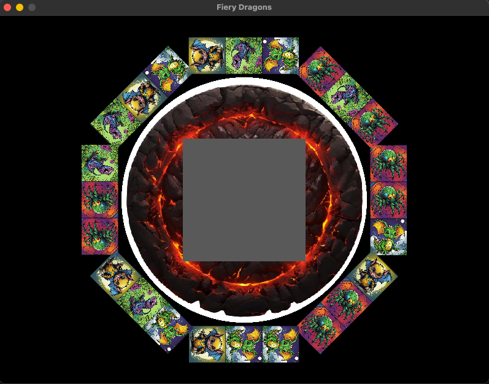

# Fiery Dragons
## Features
- Initial Game Board Setup
- Flipping and Un-flipping of Dragon Cards

## Preview

## How to run
Ensure you have Python installed on your system.
1. Install pygame using `pip install pygame`
2. Run `python main.py` from the terminal.