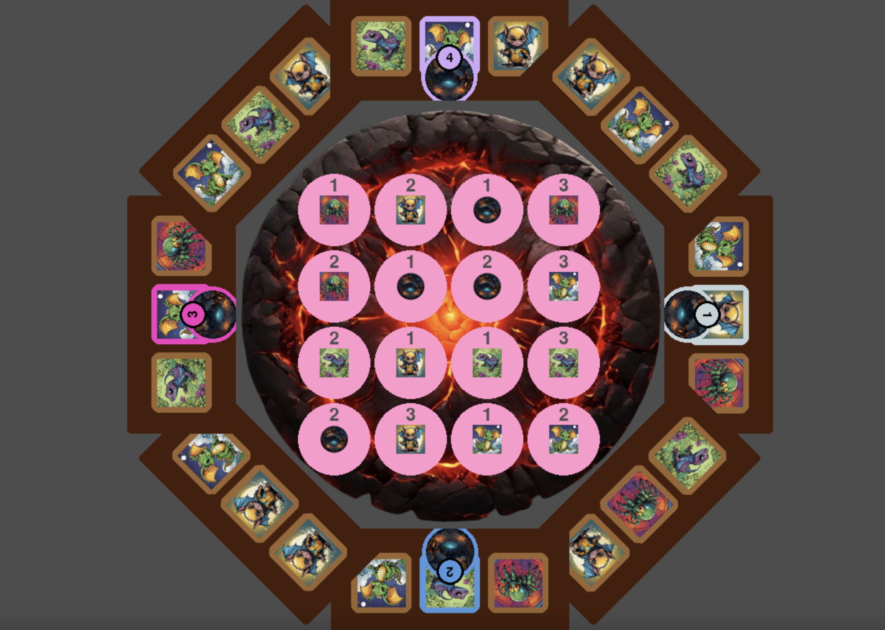

# Fiery dragons game
## Features implemented
- set up the initial game board (including randomised positioning for dragon cards)
- movement of dragon tokens based on their current position as well as the last flipped dragon
- demo link : https://youtu.be/27szs-Ha4rI

## Preview

## Key Files
- **config.ini**: Configuration file for game settings. (However currently configuration is hardcoded in `GameDataController.py`)
- **main.py**: Entry point of the game.
- **PlayerMoveController.test.py**: Test cases for movement logic.

## Known Issues 🐞
- Chit Card Click Detection Bug: Click detection for chit cards is limited to the top-left of the card

## How to run
### Prerequisites
Ensure you have Python installed on your system.
1. Install pygame using `pip install pygame`
2. Run `python main.py` from the terminal.