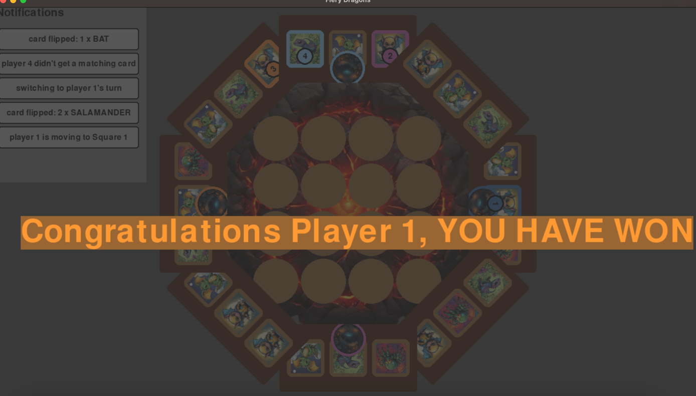

# Fiery dragons game
## Features implemented
- Set up the initial game board (including randomised positioning for dragon cards)
- Flipping of the dragon card (dragon card will be automatically flipped back after 1 second)
- Movement of dragon tokens based on their current position as well as the last flipped dragon
- Changing turns between players if a player fails to move
- Notification tab to show the latest game states
- Announce winning player when they reached their cave

## Preview

## Key Files
- **config.ini**: Configuration file for game settings. (However currently configuration is hardcoded in `GameDataController.py`)
- **main.py**: Entry point of the game.

## Known Issues 🐞
- FIXED ✅ ~~Chit Card Click Detection Bug: Click detection for chit cards is limited to the top-left of the card~~
- Volcano cards overlapping in smaller screen dimensions

## How to run
### Steps
1. Unzip FieryDragonExe.zip
2. Look for main unix executable file

3. Click on the file and let it run (it might take a while to load the game)

4. It should create a pygame window and display the game ( Game UI might be cropped if the screen dimensions are too small)