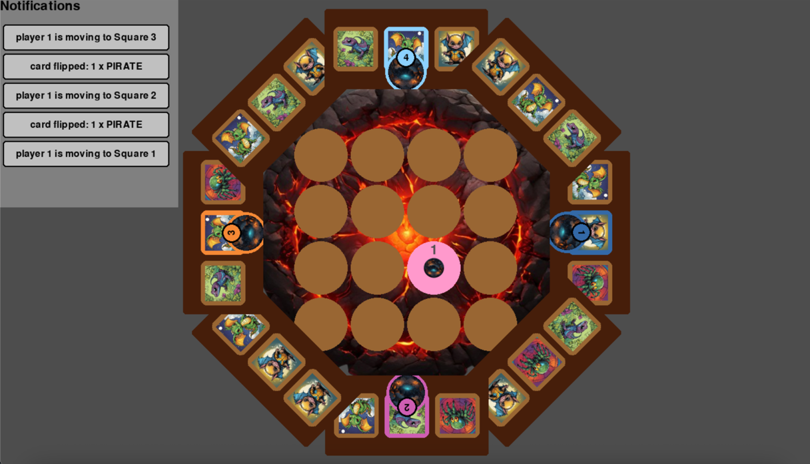
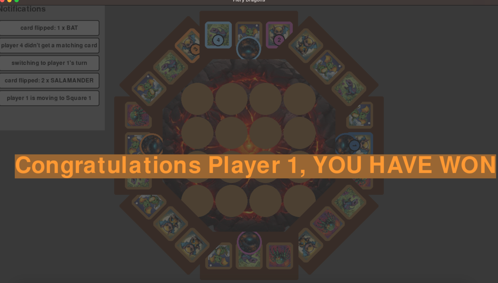
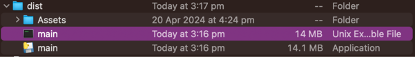
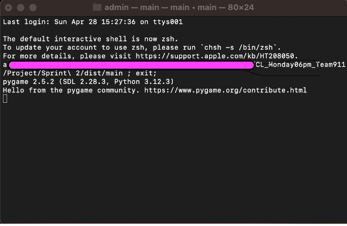

# Fiery dragons game
## Features implemented
- StartGameMenu
- Timer
- Player Lives
- Card effects Game Controller
- Special effects Controller
- Saving and Loading from external file
- Changing Number of players

## Preview

## Key Files
- **config.JSON** and **config.default.JSON**: Configuration file for game settings. (However currently configuration is hardcoded in `GameDataController.py`)
- **main.py**: Entry point of the game.

## Known Issues 🐞
- Volcano cards overlapping in smaller screen dimensions

## How to run
### Steps
1. Unzip FieryDragonExe.zip
2. Look for main unix executable file

3. Click on the file and let it run (it might take a while to load the game)

4. It should create a pygame window and display the game ( Game UI might be cropped if the screen dimensions are too small)